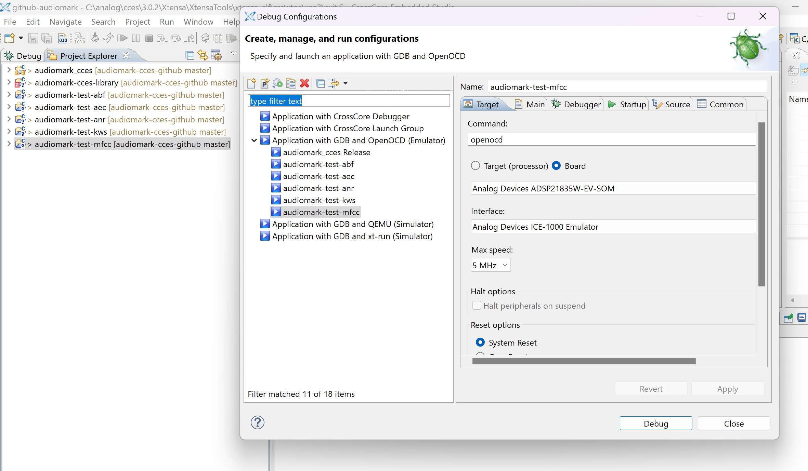

# Audiomark for SHARC-FX Processor

## Introduction
Introduction
Welcome to the Audiomark project for the SHARC-FX processor. This project is designed to benchmark audio processing capabilities of SHARC-FX processor using the CrossCore Embedded Studio (CCES) development environment. This README file will guide about the setup, compilation, and execution of the Audiomark project. It consists of several folders, each serving a specific purpose in the development and optimization process.

## Prerequisites
Ensure the presence of following:

CrossCore Embedded Studio (CCES): Version 3.0.0 or later.
SHARC-FX Processor: Ensure the processor is properly connected and configured using ICE 1000 or later version emulator.
Audiomark Source Code: Download or clone this Audiomark project repository.

## Installation
Install CCES: Follow the installation instructions provided by Analog Devices to install CCES on your development machine.
Clone the Repository: Use the following command to clone the Audiomark project repository:

## Folder Structure
The project is organized into the following folders:

1. **Audiomark**
This folder contains:
- All the source code obtained from the Audiomark GitHub repository.
- The `adi_sharcfx` folder in the `ports` directory for SHARC-FX specific code.
- The `Lib/speexdsp/libspeexdsp` folder, which contains override files with SHARC-FX optimized code.

2. **Audiomark-makefile**
This folder is used to build the project using a makefile and run the project using command line interface.

3. **Audiomark-sharc-fx-cces**
This folder is intended for building the project within the CCES platform.

4. **Audiomark-cces-library**
This folder is used to build Audiomark files as a library, which can then be used in test case project folders.

5. **Audiomark-testcases**
This folder contains five separate test case projects, which are designed to be run in the CCES platform.

6. **Profiling Reports**
This folder contains profiling reports of the entire project after each function optimization.

7. **Result Screenshots**
This folder contains screenshots of the Audiomark results after each function optimization.

8. **changes_log.md**
This file contains the change history of the project.

9. **readme_sharcfx.md**
This file provides step-by-step instructions for running this project on the CCES platform, and using command line.


## Getting Started with Command Line
To run the project using the command line interface, follow the steps below. This method is based on the contents of the `Audiomark-makefile` folder.

### Build Configuration:
Navigate to the `Audiomark-makefile` directory and run the `project_build.bat` script in MSYS2:

   ```bash
   project_build.bat
   ```
This script will run make for each project folder inside and generate .dxe executable files for the SHARC-FX processor. This builds the audiomark project and the test cases and displays a build successful message upon completion.

### Execution
Once the build is complete and the hardware is connected, run the project_run.bat script:

   ```bash
   project_build.bat
   ```
This script will load the generated .dxe files onto the SHARC-FX hardware and execute all project components and test cases. At the end, it displays complete. Output result saved to final_output.log.
After successful execution, check the final_output.log file for the complete results of the test cases and performance metrics. 

## Getting Started with CCES
To get started with this project, follow the instructions mentioned which will guide through the setup and execution process on the CCES platform.

### Project Setup
- Open CCES: Launch CrossCore Embedded Studio.
- Import Project:
- Go to File > Open projects from file system and select the Audiomark project directory, and select 
- Click Finish to import the project.
- Again, Go to File > Open projects from file system and select the audiomark-testcases/audiomark-test-abf, audiomark-testcases/audiomark-test-aec, audiomark-testcases/audiomark-test-anr, audiomark-testcases/audiomark-test-kws, audiomark-testcases/audiomark-test-mfcc.
- Click Finish to import the project.

### Build Configuration:
 For all the projects, select the Release build configuration by right-clicking on the project in the Project Explorer, and build the project. This will generate a .dxe file in the Release folder.
For the audiomark-cces-library project, it will generate a .a library file, which is virtually added to all the test cases project. No need to follow the execution step for this project, only .a file is needed from this project.

### Resolve Dependencies:
Ensure all necessary libraries and dependencies are included in the project settings. Check the Properties of the project to verify the include paths and library paths.

### Execution
- Connect SHARC-FX Processor
- Ensure the SHARC-FX processor is connected to laptop via emulator.
Load Program:
- In CCES, go to Run > Debug Configurations.
- Select Application with GDB and OpenOCD emulator, and launch new configuration.
- Select Board as target, Analog Devices ADSP 21835W-EV-SOM, with max 5Hz speed.
- Make sure to configure project.dxe file in C/C++ application in main settings.
- Click Debug to load the program onto the SHARC-FX processor.

### Run Audiomark:
- Once the program is loaded, click Resume to start execution.
- Monitor the output in the console window for benchmarking results.
- Follow the same process to run the test cases, and monitor the output or pass fail in the console window.



### Troubleshooting
Compilation Errors: Check the include paths and library paths in the project settings.
Connection Issues: Ensure the SHARC-FX processor is properly connected and powered.
Runtime Errors: Use the debugger to step through the code and identify issues. If the CCES shows <optimized out> variable values, use the debugger in the debug build configuration.


## Additional Resources
- CCES : https://www.analog.com/en/resources/evaluation-hardware-and-software/software/adswt-cces.html#software-discussions
- SHARC-FX processor : https://www.analog.com/en/products/ADSP-21835.html
- SHARC-FX Optimization : https://www.analog.com/media/en/technical-documentation/app-notes/ee-472.pdf

## Contact
For any questions or support, please contact - aradhita.sharma@analog.com

